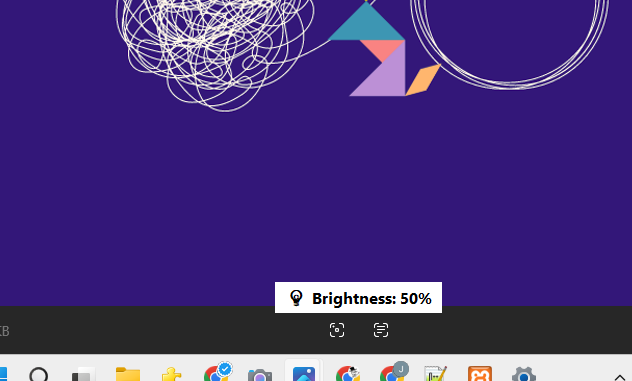

# 🎹 Laptop Custom Hotkeys for Volume & Brightness (Ctrl + Arrow Key Shortcuts)

A lightweight **AutoHotkey v2** script that adds **custom Ctrl + Arrow key shortcuts** for controlling **system volume and screen brightness** on any Windows laptop.  

Designed for quick, keyboard-based control — with a clean **on-screen display (OSD)** that appears briefly at the bottom center of your screen.

---

## 🎯 Features

✅ **Ctrl + Up / Down** → Adjust **system volume**  
✅ **Ctrl + Left / Right** → Adjust **screen brightness**  
✅ Minimal **white OSD** with:
- Compact popup near bottom center  
- Rounded corners, Segoe UI font  
- Auto-hides after 1 second  

Works on **Windows 10/11** with **AutoHotkey v2.0+**

---

## 💻 Demo

| Volume OSD | Brightness OSD |
|-------------|----------------|
|  |  |

*(Add your screenshots in `/screenshots`.)*

---

## 🚀 Installation/Setup

### 1️⃣ Using the Compiled .exe

Go to the Releases section on GitHub.

Download the latest laptop-hotkeys.exe.

Run the .exe — no AutoHotkey installation required.

Use Ctrl + Arrow keys as described.

### 2️⃣ Using the `.ahk` Script
1. Install [AutoHotkey v2](https://www.autohotkey.com/download/).  
2. Clone the repository:
   ```bash
   git clone https://github.com/Jaya-Weera/Laptop-Custom-Hotkeys-for-Volume-Brightness-Ctrl-Arrow-Key-Shortcuts-.git
   cd laptop-hotkeys
 3. Run the script:
   Double-click src/laptop-hotkeys.ahk
   A green “H” icon appears in the system tray

 4. Use Ctrl + Arrow keys to control volume and brightness.


### 📌 Optional: Run on Windows Startup

Press Win + R, type shell:startup, and press Enter.

Copy laptop-hotkeys.exe into the Startup folder.

From now on, the program will automatically run whenever Windows starts.

✅ Tip: You can also create a desktop shortcut or pin it to the taskbar for quick access.


####⚙️ Script Overview
###🔈 Volume Control
Uses native AHK SoundGetVolume() and SoundSetVolume() to adjust system master volume smoothly.

###💡 Brightness Control
Uses Windows WMI (root\WMI) interface:

text
Copy code
WmiMonitorBrightness
WmiMonitorBrightnessMethods
with Active=TRUE to adjust the current display brightness.

###🪟 On-Screen Display (OSD)
Displays a small centered popup showing:

yaml
Copy code
🔊 Volume: 52%
💡 Brightness: 75%
White background

Rounded edges

Auto-hide after 1 second

 

⚠️ Notes
Works on most Windows laptops and PCs.

Requires AutoHotkey v2.0+ (not v1).

Brightness control may not work if your device uses custom GPU drivers that disable WMI access.

⚡ Compiling to EXE (Optional)

If you want a standalone executable:

ahk2exe /in src/laptop-hotkeys.ahk /out build/laptop-hotkeys.exe /icon assets/hotkey.ico


GitHub Actions can also automatically compile the .exe on every tagged release. 
📜 License
This project is licensed under the MIT License — free to use, modify, and distribute.
See the LICENSE file for details.

❤️ Author
Jaya Weera
Full-Stack Developer & Tech Enthusiast
🌍 Sri Lanka


